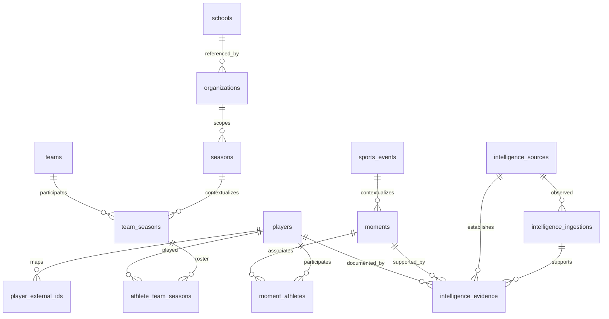

# Minimum viable BLTZ Intelligence graph

Deployment update: the five-table foundation and audited source-review RPC are now deployed to staging and production; the first reviewed Keith Rivers sources are attached. See [deployment and source-promotion record](graph-deployment-2026-09-30.md). Initial local-only statements below describe the original slice approval, not current deployment state.

## Objective and authority

Build an inspectable, provider-independent path from Athlete Career ID to documented Moment to deterministic Signal to evidence-backed Opportunity, preserving the Wizard-of-Oz cohort. The coordinator approved the five-table foundational slice after the repository audit on September 30, 2026. No deployed migration or cohort backfill is included.

References: supplied AGENTS.md Product Doctrine, `docs/media/MEDIA-GRAPH-ROADMAP.md`, `docs/BLTZ_BUILD_ORDER.md`, and the explicit Intelligence task override. See `current-state-audit.md` for the limited reconciliation with older CRM phase restrictions.

## Entity evaluation

| Required concept | Minimum decision | Initial implementation |
| --- | --- | --- |
| Athlete | Canonical `players.id`, account independent | Reuse |
| Organization | Existing tenant, not imported team identity | Reuse |
| School | Existing reference directory | Reuse |
| Team | Retain existing `teams.id`; future external matches reviewed | Reuse |
| League | Useful competition context; registry premature | Source candidate metadata; defer table |
| Season | Existing canonical season where matching context exists | Reuse; unresolved provider seasons remain candidates |
| Game/Event | Existing shared `sports_events.id` | Optional Moment FK, no forced invented event |
| Moment | Explicit occurrence, independent of asset/account | New `moments` |
| Performance | Supporting source facts, existing season stat adapters | Evidence `fact_type=performance`; defer competing performance table |
| Award | Existing UUID award records/catalog, explicit provenance adapter | Reuse; year-only Moment remains year precision |
| MediaAsset | Future canonical descriptors and normalized Moment/athlete joins | Legacy read adapters only; defer schema and storage changes |
| Relationship | Typed roster/event/Moment joins | New `moment_athletes`; no generic arbitrary edge table |
| ExternalIdentity | Existing verified `player_external_ids` authority | Read adapter; unresolved IDs retained in ingestion candidates |
| Source | Source registry plus timestamped observation | New `intelligence_sources`, `intelligence_ingestions` |
| Signal | Versioned deterministic evaluator over reviewed facts | Pure read-only Signals agent output; no persisted table |
| Opportunity | Potential human action from explainable signals | Pure read-only Signals agent output; no campaign or earnings model |

## Relationships

The read pipeline is `verified athlete association → verified Moment + dated sourced evidence → versioned Signal → Opportunity`. Future MediaAsset connections attach to Moments and athletes through normalized joins. Media appearance, sports participation, contribution, source credit, legal ownership and economic participation remain separate concepts. No contribution or payment is inferred from an image.

## Schema contract

All five new tables use UUID IDs, `created_at`, `updated_at`, restrictive FKs, RLS and service-only select/insert/update grants. No browser privileges or DELETE grants exist. The existing server admin authorization precedes the service client. Raw payloads must never enter Lab props, client responses, logs, or public pages.

| Table | Relevant fields and invariants |
| --- | --- |
| `intelligence_sources` | `source_key` unique; name/provider labels. Provider text lives in provenance, never becomes canonical athlete identity |
| `intelligence_ingestions` | Source FK; namespace/external ID; safe locator; required fetched time/normalizer version/idempotency key; raw payload; object candidate; normalization status. Raw/source/time/locator/version fields immutable; corrections create a new observation |
| `moments` | Title; optional event FK; sport label; nullable confidence; review status; exact date, year, or unknown precision. A year does not manufacture January 1. Exact day requires matching nonnull year |
| `moment_athletes` | Canonical athlete and Moment FKs; featured/participant/contributor relationship; independent review and confidence; unique per role. One athlete may have several explicit roles |
| `intelligence_evidence` | Canonical athlete FK, optional Moment FK, source FK, optional ingestion FK, fact type, statement, object structured data, confidence and status. Composite source/ingestion FK prevents attributing an observation to the wrong source |

Confidence ranges from zero to one; null means unknown, not zero or verified. Verification is an independent state. No ambiguous candidate creates or merges a canonical athlete. `normalization_status` distinguishes pending, normalized, needs_review, ambiguous, rejected and failed.

There is no generic `entity_type + arbitrary_id` canonical graph. Foreign keys validate the initial athlete/Moment scope. Structured data contains supporting values and evidence paths rather than unvalidated alternative athlete IDs.

An evidence trigger requires an explicit matching `moment_athletes` association whenever a Moment is attached; association athlete/Moment IDs cannot be rewritten. Write the association before its evidence. Verification remains independent: a consumer must require a matching, verified association before generating a signal. The signal evaluator applies that additional gate. Historical/team/global-season mapping without tenant context remains unresolved; no fictitious tenant or affiliations are inserted.

## Agent contracts

`lib/intelligence/contracts.ts` provides camelCase read DTOs: `GraphMoment`, `GraphEvidence`, `GraphSourceReference`, `GraphMomentAthlete`, and `GraphExternalIdentity`. SQL maps snake_case fields to these objects at the server read boundary. The server selects reviewed metadata rather than forwarding raw records.

External identity DTO `namespace` projects the existing mapping scope (`league`) and identifies `source=player_external_ids`. Normalizers may use richer sport/competition namespaces, but the resolver must explicitly translate compatible existing scopes and reject mismatches. Do not claim all providers/sports are persisted through the current nfl/ncaafb-constrained mapping table.

Source references allow null IDs/locators/fetched times only for honest legacy adapter output. Missing provenance must be visible as incomplete and cannot create an evidence-backed signal automatically. New persisted evidence always has a source UUID. The Lab distinguishes unavailable schema, query failure, malformed records, and valid empty results.

Signals retain Moment and athlete IDs, rule/version, detection time, target time, confidence, score and human explanation. Opportunities retain associated Moment and signal IDs and evidence. An opportunity is a potential action, not a contractual right, approved campaign, estimated payout or athlete earnings.

## Migration and implementation sequence

1. Audit canonical and competing models; agree shared DTOs before independent implementation.
2. Create the additive migration with the installed Supabase CLI. `DO_NOT_TRACK=1` avoids an unrelated telemetry write outside the workspace.
3. Execute the migration in isolated PGlite with minimal pre-existing UUID entities. Validate referential integrity, precision, provenance, allow/deny privileges and cohort isolation.
4. Generate additive TypeScript row/insert/update types from the executable local PostgreSQL catalog using `node scripts/generate-intelligence-types.mjs`; verify reproducibility with `node scripts/generate-intelligence-types.mjs --check`. This preserves the pre-existing dirty full database type file. The isolated generator is not authoritative full Supabase type generation.
5. Signals agent implements pure rules; Data agent implements provider-normalization and verified mapping read adapter; Lab consumes approved contracts through existing internal admin authorization.
6. During separately authorized deployment, reconcile real schema/migration history and Phase 2 dependencies, inspect advisors, apply first to staging, regenerate full Supabase types using `supabase gen types --local` or approved project access, and rerun admin/unauthorized checks.

No automatic seeding, athlete creation, identity merging, backfill, public publishing, provider request or live schema mutation is part of this migration. Roll forward or disable the Lab on failure; do not drop sourced history as a rollback shortcut.

## Risks and exclusions

- Provider-bound existing mapping and raw-stat tables remain authoritative for cohort integration. A future mapping evolution must avoid dual authority, account for contradictory mappings and preserve reviewed imports.
- Existing scoped seasons cannot be treated as global competition seasons. Generic canonical league/event/affiliation resolution requires a follow-up contract.
- Scraped awards contain text athlete identifiers; only explicit canonical UUID mapping is safe.
- Legacy media descriptors are evidence of discoverability, not permissions. No storage, clearance or rights-engine functionality is implemented.
- Facts are not yet immutable historical revisions. Raw observations are immutable; reviewed evidence updates require a future administrative review/audit workflow. Initial slice has no exposed mutation UI or automated writer.
- Service-role callers must enforce authorization; service RLS bypass is intentional existing infrastructure, not browser access.
- Local migration execution and generated types do not attest deployed production inventory or real athlete accuracy.
- Signals/opportunities are recomputed, not persisted, assigned or notified. Performance, canonical media, league registry and generic external entity mappings are designed/deferred, not claimed implemented.

## Acceptance and validation

`npx vitest run tests/database/intelligence-graph-migration.test.ts` executes actual SQL. It verifies canonical traversal, invalid/missing dates, nullable uncertainty, confidence bounds, duplicate/orphan relationships, source/ingestion mismatch, raw immutability, browser denial, service operations and absence of cohort rewrites. Lint applies to contracts, generated types, script and tests. The coordinator runs overall typechecking/build and combined regressions.

Manual staging: confirm migration presence and exact source labels; sign in as existing internal admin; search an existing canonical athlete; inspect empty or reviewed Moments and evidence; verify no raw payload reaches browser requests; repeat as non-admin and anonymous; confirm existing previews, claims and Locker views remain functional. Existing public media authorization remains unchanged. No real athlete fixture is fabricated; source-backed integration examples require actual approved historical records.

## Product direction completion

The new relationships strengthen Athlete→Moment and Source→Evidence→Athlete/Moment with uncertainty preserved. Existing career/team/event relationships remain canonical. Moment contribution roles are explicit and unmonetized. No Value Graph relationship or payment workflow is introduced. Historical evidence remains useful after an athlete leaves an organization. No mature DAM, media-distribution, editing or CRM workflow is rebuilt, and no scope drift toward generalized media management is introduced.
