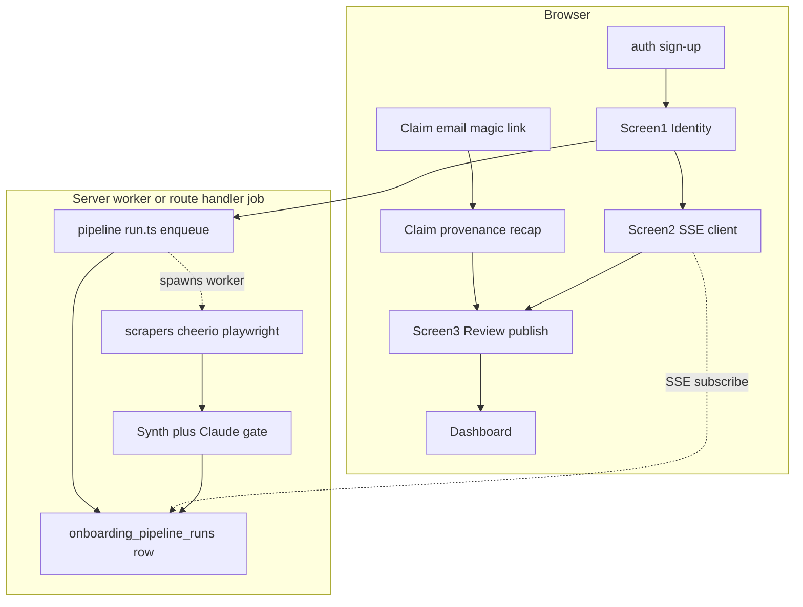

# Onboarding flow + production wire-up

**Status:** Ready to build (mirrors Cursor plan `onboarding-and-wireup_c3a16b73`).  
**Last updated:** 2026-05-05  
**Canonical plan file (IDE):** `.cursor/plans/onboarding-and-wireup_c3a16b73.plan.md` (path may vary per machine)

## Overview

Build founder-spec onboarding (identity, AI magic-moment via SSE, review/publish) with claim and self-serve entry, merged with office-hours P0 corrections: role-aware redirects, first-session checklist matches shipped UX, claim provenance recap, pipeline degrade path. Then wire dashboard and locker off placeholders.

**Related specs**

- Brand and motion: [.claude/worktrees/busy-hellman-6b7937/DESIGN.md](../../.claude/worktrees/busy-hellman-6b7937/DESIGN.md)
- Dashboard IA and first-session: [.claude/worktrees/busy-hellman-6b7937/docs/planning/dashboard-plan.md](../../.claude/worktrees/busy-hellman-6b7937/docs/planning/dashboard-plan.md)

**Integrated:** Office-hours plan review verdict (role-aware redirects, checklist vs deferred features, claim recap, pipeline degrade path, trust UI, instrumentation) merged as P0 product gates below.

## Implementation checklist

- [ ] Schema migration (`players` extensions, `onboarding_pipeline_runs`, `claim_tokens`, `media`, headshots bucket, RLS)
- [ ] Scrapers (`lib/pipeline/scrapers`)
- [ ] AI synthesis + orchestration (`lib/pipeline/claude.ts`, `run.ts`; server-side job, not Edge Playwright)
- [ ] SSE endpoint `GET /api/onboarding/pipeline/[runId]`
- [ ] Pipeline degrade paths (retry, disambiguation, manual publish always available)
- [ ] Screen 1: `app/onboarding/page.tsx` + IdentityForm, SchoolCombobox
- [ ] Screen 2: `app/onboarding/loader` + MagicMomentLoader
- [ ] Claim provenance recap before review (substitute for skipped magic moment)
- [ ] Screen 3: `app/onboarding/review` + unverified machine fields until confirmed
- [ ] Claim route + admin claim-tokens API
- [ ] `POST /api/onboarding/publish` (atomic state transition)
- [ ] Middleware: role-aware onboarding redirect (fans not railroaded)
- [ ] Dashboard wire-up (real name, setup redirect, FirstSessionOverview checklist matches shipped routes)
- [ ] Locker LIVE wire-up (columns, media table, strip logs, mock dev-only)
- [ ] Copy QA (DESIGN.md vocabulary)
- [ ] Minimal onboarding metrics (funnel, pipeline vs manual, claim SLA)
- [ ] Tests per test plan section

## Office-hours P0 amendments (must ship with this slice)

| Gap | Requirement |
|-----|-------------|
| Fan hostage | Do not redirect every user without `player_id` into player onboarding. Only athletes: e.g. `profiles.role === 'player'` plus explicit intent (invite, claiming token, visiting `/dashboard` as locker owner), OR post-auth branching "claim my locker" / "I am browsing as a fan". Document exact rule beside middleware code. |
| First-session checklist | Dashboard-plan promised theme + pipeline checklist items while Theme and Pipeline queue UI remain deferred out of scope. **Either** checklist items ONLY link to routes that exist in this slice (`/onboarding`-complete headshot via settings, `/player/[slug]`, share/copy, optional `/dashboard/videos`) **or** add minimally shippable stubs (preset theme picker, queue placeholder route with copy). No dead checklist rows. |
| Claim path WOW | Claim flow skips SSE Screen 2. Insert **trust + provenance recap** immediately after token validate: bullet sources (ESPN, Wikipedia, founder archive rows), what's AI-draft vs curated, invitation to verify numbers. Narrative substitutes magic theater for transparency. |
| Pipeline failure | Scrapers WILL fail (blockers, timeouts, wrong person). Mandatory: retry with structured disambiguation (school cohort, jersey yr), **manual completion** escape hatch; publish always reachable. Never gate publish purely on scrape or LLM success. |
| Trust surface | Prefer **confirmed-by-athlete** for machine-derived numerics versus silent truth. Badge or subdued styling until user confirms Review row aligns with hallucination gate. |
| Observability | Instrument minimal funnel: signup to publish, pipeline success vs manual fallback, claim link time to publish. |

## Architecture

**Note:** The browser consumes SSE driven by **`onboarding_pipeline_runs` updates**. Scraping (Playwright, cheerio) runs on long-lived Node (or a background job / Vercel pattern that allows Node), not from an Edge-only runtime without Node.

## Brand + UX rules (from DESIGN.md)

- No "Welcome to BLTZ", "Get started", or "Unlock". First-person where it fits locker voice.
- Football vocab on user-facing chrome: claim, career, locker, believer. Avoid "profile", "import", "follower" in labels and marketing chrome (fields can still map to tables).
- Forms: labels above inputs, tall fields, radius per DESIGN.md, inline errors, touch targets, mobile intentional layout, sticky CTAs where needed. SSE log respects `prefers-reduced-motion`.
- Magic moment SSE copy pattern (D2) when self-serve path runs Screen 2.

## Phase 1 — Schema + storage

New migration in [lib/supabase/migrations](../../lib/supabase/migrations):

- Extend `players`: `dob`, `height_in`, `weight_lbs`, `games_played`, `position`, `level` (check `college|pro|former`), `current_status` as needed.
- `onboarding_pipeline_runs`: `id`, `player_id`, `status` (`pending|scraping|generating|complete|error|manual`), `events jsonb`, timestamps.
- `claim_tokens`: `player_id`, `token` unique, `expires_at`, `claimed_at`.
- `media`: provenance enum per A2 `founder_archive|cal_archive|athlete_uploaded|fan_uploaded`, display order.
- Storage `headshots` with RLS path scoped to owner.
- Optional: `player_lockers` or JSON flags for which fields athlete confirmed on publish (supports unverified UI).

## Phase 2 — AI pipeline

Under `lib/pipeline/`:

- `scrapers/` per source; two-stage cost model (cheap extract then flash-class model; Claude for gate plus polish if budget allows).
- `claude.ts`: hallucination gate (T1), numeric cross-check.
- `run.ts`: append events to run row, token cap, retries, top-10 candidates (R5).
- Degrade: on terminal error set `status=manual`, emit user-facing event, offer Review with empty or partial draft.

## Phase 3 — Onboarding routes + components

`app/onboarding/`:

- `layout.tsx`: minimal shell.
- `page.tsx`: Screen 1; `POST /api/onboarding/start` returns `runId`, navigate to loader.
- `loader/page.tsx`: SSE subscription only.
- `claim/[token]/page.tsx`: validate token, then **ClaimRecap** (sources, provenance), then Review with prefill.
- `review/page.tsx`: edit, confirm unverified blocks, headshot, slug, preview iframe (postMessage, R1).

APIs: `POST /api/onboarding/start`, `GET /api/onboarding/pipeline/[runId]` (SSE), `POST /api/onboarding/publish`, headshot upload, admin `claim-tokens`.

**Middleware** [middleware.ts](../../middleware.ts): role-aware rule set; document in a comment block; fans skip player onboarding redirect.

## Phase 4 — Production wire-up

- [app/dashboard/page.tsx](../../app/dashboard/page.tsx): redirect missing player to onboarding only on athlete path; replace "Champion" with real name; `FirstSessionOverview` checklist aligned to shipped links.
- [lib/queries/dashboard.ts](../../lib/queries/dashboard.ts): achievements `0` until table exists.
- [app/player/[slug]/page.tsx](../../app/player/[slug]/page.tsx): real columns, media query, remove placeholders, strip logs, mock path dev-only.
- [lib/rbac.ts](../../lib/rbac.ts): publish flips `role` to `player` and sets `player_id`.

## Test plan

- Fan signup never forced into player `/onboarding` flow.
- Pipeline failure: user can still publish via manual path.
- Claim e2e: recap, then review.
- `FirstSessionOverview`: every checklist item hits a live route or is hidden.
- Unit, integration, e2e, mobile 375px, RLS as in earlier plan revision.

## Out of scope (defer)

- Full theme, premium, Stripe (per dashboard-plan deferrals).
- Full pipeline queue UI; founder approval stays out-of-band until separate sprint.
- Achievements table, auto-highlight ML, light mode, native app.

## Risk register

- R1: Live preview iframe jank — postMessage patch model on Screen 3, not full reload.
- R5: Cap pipeline candidates per run.
- R6: Theme deferred — brand defaults during onboarding.
- R8: Analytics batching remains a later concern.
- R9: Wrong-athlete ambiguity — mitigate with Screen 1, recap, manual edit.
- R10: Checklist promises vs shipped routes — eliminated by amendments above.
